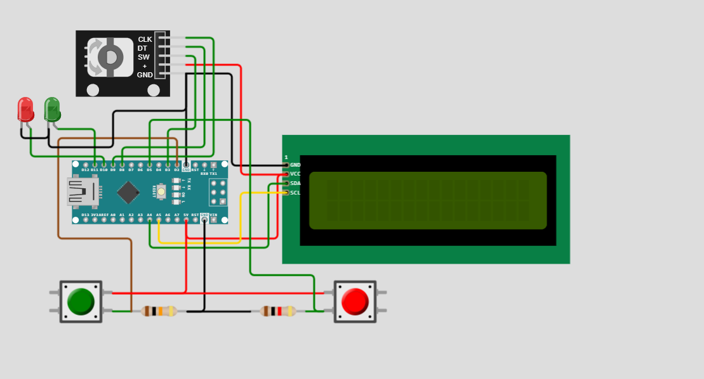

# Arduino
Программа управления двигателем со счетчиком оборотов по датчику холла.
Установка угла поворта происходит через настройки с помощью энкодера.
Дологое нажатие кнопки энкодера переключает из режима управления в режим настройки и обратно.
 

